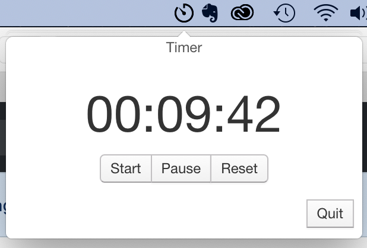

# Tray Example

An example app for building a native-looking Mac OS X tray app with a popover
using [Electron](http://electron.atom.io).

The app implements a simple timer application

Built with [photon](http://photonkit.com).

## Running

```sh
git clone https://github.com/patrickgue/Timer
cd Timer
npm install
npm start
```

## Packaging

```sh
npm run package
open out/Timer-darwin-x64/Timer.app
```


## Screenshot



